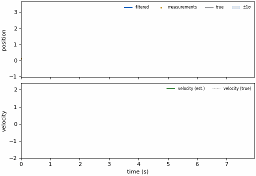

# kalbee

<div align="center">
  
</div>

<br>

`kalbee` is a clean, modular Python implementation of Kalman Filters and related estimation algorithms. Designed for simplicity and performance, it provides a standard interface for state estimation in various applications.

## Why kalbee?

| | kalbee | FilterPy | pykalman | simdkalman | Stone Soup |
|---|---:|---:|---:|---:|---:|
| Filter implementations | **18** | ~10 | 2 | 1 | ~6 |
| Multi-object tracking (SORT/JPDA/PMBM) | ✅ | ❌ | ❌ | ❌ | ✅ (heavier framework) |
| Smoothers | RTS/EKF/UKF/fixed-lag | RTS only | RTS only | ❌ | ✅ |
| Learning (EM, online EM, NIS auto-tune, KalmanNet) | ✅ | ❌ | EM only | ❌ | Partial |
| Vectorized/batched filtering | ✅ (beats simdkalman ~4x, see [benchmarks](docs/benchmarks.md)) | ❌ | ❌ | ✅ | ❌ |
| pandas / Polars / scikit-learn integration | ✅ | ❌ | ❌ | ❌ | ❌ |
| CLI (`kalbee demo --live`, `kalbee bench`) | ✅ | ❌ | ❌ | ❌ | ❌ |
| Actively maintained (2026) | ✅ | mostly dormant | mostly dormant | mostly dormant | ✅ (defence-oriented) |

All numbers are reproducible — see [docs/benchmarks.md](docs/benchmarks.md) and [`scripts/compare_benchmarks.py`](scripts/compare_benchmarks.py) for the honest version, including where FilterPy still wins (raw single-filter-loop overhead).

## Features

- **18 Filters**: KF, EKF, UKF, SigmaPointUKF, Particle Filter, Ensemble KF, Information Filter, Alpha-Beta-Gamma, Adaptive KF, Square-Root KF, Vectorized KF, Fading Memory KF, H-Infinity, Interacting Multiple Model (IMM), Invariant EKF (InEKF on SO(3)/SE(3)), Variational Bayes Adaptive KF (VBAKF), Cubature KF (CKF), and Rao-Blackwellized Particle Filter (RBPF)
- **Advanced Tracking**: SORT-style `MultiObjectTracker`, Joint Probabilistic Data Association (`JPDAAssociation`), and Poisson Multi-Bernoulli Mixture (`PMBMTracker`) for multi-target tracking in heavy clutter
- **Real-Video Examples**: bounding-box tracking of vehicles/people via YOLO (`examples/yolo_*.py`), plus a pedestrian-tracking demo on the real MOT16 dataset (`examples/mot16_pedestrian_tracking.py`, `scripts/mot16_demo.py`)
- **Animated Demos**: `.gif` galleries built from the public API — see the [Examples & Gallery](docs/examples.md)
- **Non-Linear Smoothers**: RTS Smoother, Extended RTS Smoother, Unscented RTS Smoother, and Fixed-Lag Smoother
- **Asynchronous Sensor Fusion**: `AsyncSensorBuffer` for out-of-sequence measurements (OOSM) and multi-rate sensors
- **Learning & Neural Filters**: Offline EM, Online EM, NIS Auto-Tuning, and PyTorch `KalmanNet` hybrid neural filter
- **Factor Graph Export**: Export filter trajectories to Factor Graph format (`FactorGraphExporter`) for global non-linear optimization
- **Sigma Points**: Pluggable strategies — SimplexSigmaPoints, MerweScaledSigmaPoints, JulierSigmaPoints
- **Motion Models**: Ready-made constant-velocity, constant-acceleration, and coordinated-turn `(F, Q)` builders plus position measurement models
- **Innovation Gating**: Chi-squared and Mahalanobis gating for outlier rejection
- **Outlier Detection**: Real-time `Chi2OutlierDetector` with adaptive thresholds
- **Diagnostics**: `FilterDiagnostics` for real-time monitoring, NIS/NEES consistency tests, innovation whiteness test
- **Metrics**: RMSE, NEES, NIS, Log-Likelihood for filter diagnostics
- **Batch Processing**: `filter_sequence()` with missing data handling
- **State Persistence**: `save_state()` / `load_state()` for JSON serialization
- **Control Inputs**: B matrix support in KF predict step
- **Experiment Runner**: Compare filters on synthetic signals with one line
- **AutoFilter Factory**: Switch between filters by name
- **Numerical Stability**: Joseph form covariance updates, Cholesky factor stabilization, and symmetry enforcement
- **NumPy/SciPy & PyTorch Integration**: Optimized for numerical computations and differentiable learning
- **Sensor-Fusion Cookbook**: Ready-made quaternion attitude EKF (gyro+accel) and GPS+IMU loosely-coupled fusion recipes
- **Numerical Jacobians**: `numerical_jacobian()` builds EKF Jacobians from plain Python functions — no hand-derivation needed
- **scikit-learn Integration**: `KalmanEstimator` — drop any filter into an `sklearn.Pipeline` via `fit`/`transform`/`predict`
- **CLI**: `kalbee demo --live` (animated terminal chart), `kalbee bench`, `kalbee new` (scaffold a starter script)
- **Typed**: Ships `py.typed` for IDE autocomplete and static type checking

## Installation

```bash
pip install kalbee
```

Or from source:

```bash
git clone https://github.com/MinLee0210/kalbee.git
cd kalbee
pip install -e .
```

Optional extras: `pip install "kalbee[yolo]"` (object-tracking examples), `"kalbee[viz]"` (plotting), `"kalbee[docs]"` (documentation site), `"kalbee[cli]"` (animated `kalbee demo --live`), or `"kalbee[sklearn]"` (`KalmanEstimator`).

### Try it with zero code

```bash
pip install "kalbee[cli]"
kalbee demo --live --filter kf --signal sine   # animated terminal chart
kalbee bench                                    # speed/accuracy across all filters
kalbee new my_tracker.py                        # scaffold a starter script
```

### See it before you read it



Animated, runnable demos — filtering, IMM on maneuvering targets, and
multi-object tracking of **real pedestrians** (MOT16) — live in the
[Examples & Gallery](docs/examples.md), with vehicles/people bounding-box
tracking examples in `examples/yolo_mot.py`, `examples/yolo_vehicles.py`,
and `examples/yolo_people.py`.

## Quick Start

### 1. Standard Kalman Filter

```python
import numpy as np
from kalbee import KalmanFilter

state = np.zeros((2, 1))  # [position, velocity]
cov = np.eye(2)
F = np.array([[1, 1], [0, 1]])  # Constant velocity model
Q = np.eye(2) * 0.01
H = np.array([[1, 0]])
R = np.array([[0.1]])

kf = KalmanFilter(state, cov, F, Q, H, R)
kf.predict()
kf.update(np.array([[1.2]]))
print(f"Estimated State:\n{kf.x}")
```

### 2. Interacting Multiple Model (IMM) Filter

```python
import numpy as np
from kalbee import KalmanFilter, InteractingMultipleModel

kf_cv = KalmanFilter(state_init, cov_init, F_cv, Q_cv, H, R)
kf_ca = KalmanFilter(state_init, cov_init, F_ca, Q_ca, H, R)

model_transition = np.array([[0.95, 0.05], [0.05, 0.95]])
model_probabilities = np.array([0.8, 0.2])

imm = InteractingMultipleModel([kf_cv, kf_ca], model_transition, model_probabilities)
imm.predict()
imm.update(measurement)
```

### 3. SigmaPointUKF with Pluggable Sigma Points

```python
import numpy as np
from kalbee import SigmaPointUKF, MerweScaledSigmaPoints

state = np.zeros((2, 1))
cov = np.eye(2) * 10.0
Q = np.eye(2) * 0.01
R = np.array([[0.5]])

def f(x, dt):
    return np.array([[x[0, 0] + x[1, 0] * dt], [x[1, 0]]])

def h(x):
    return np.array([[x[0, 0]]])

sigma_pts = MerweScaledSigmaPoints(n=2, alpha=0.1, beta=2.0, kappa=0.0)
ukf = SigmaPointUKF(state, cov, Q, R, f, h, sigma_points=sigma_pts)

ukf.predict(dt=1.0)
ukf.update(np.array([[1.2]]))
```

### 4. Compare Filters with Experiments

```python
from kalbee import run_experiment

report = run_experiment(
    signal="sine",
    filters=["kf", "ekf", "ukf", "pf"],
    noise_std=0.5,
)
print(report.summary())
```

### 5. AutoFilter Factory

```python
from kalbee import AutoFilter

kf = AutoFilter.from_filter(state, cov, F, Q, H, R, mode="kf")
# Available modes: kf, ekf, ukf, abg, pf, enkf, if, akf, srkf, vkf, imms
```

### 6. Multi-Object Tracking

```python
import numpy as np
from kalbee import KalmanFilter, MultiObjectTracker
from kalbee.models import constant_velocity, position_measurement_model

F, Q = constant_velocity(dt=1.0, process_var=0.1, n_dims=2)
H, R = position_measurement_model(order=1, n_dims=2, measurement_var=0.25)

def new_track(z):
    x0 = np.array([[z[0]], [0.0], [z[1]], [0.0]])
    return KalmanFilter(x0, np.eye(4) * 10.0, F, Q, H, R)

tracker = MultiObjectTracker(new_track, n_init=3, max_age=5)

for detections in detection_stream:
    confirmed = tracker.update(detections)
    for t in confirmed:
        print(t.id, t.state[0, 0], t.state[2, 0])
```

See [`examples/multi_object_tracking.py`](examples/multi_object_tracking.py) for a full runnable demo.

### 7. Learn Noise Covariances from Data (EM)

```python
from kalbee import em_kalman
from kalbee.models import constant_velocity, position_measurement_model

F, _ = constant_velocity(dt=1.0, n_dims=1)
H, _ = position_measurement_model(order=1, n_dims=1)

result = em_kalman(measurements, F, H, n_iter=50)
print("Learned Q:\n", result.Q)
print("Learned R:\n", result.R)
```

### 8. Auto-Tuning

```python
from kalbee import tune_kalman_filter, quick_tune

# Iterative NIS-based tuning
result = tune_kalman_filter(measurements, F, H, n_iter=50)
print(f"Q:\n{result.Q}\nR:\n{result.R}")

# Quick single-pass tuning
Q, R = quick_tune(measurements, F, H)
```

### 9. Real-Time Diagnostics

```python
from kalbee import KalmanFilter, FilterDiagnostics

kf = KalmanFilter(state, cov, F, Q, H, R)
diag = FilterDiagnostics(m=1, n=2)

for z in measurements:
    kf.predict()
    kf.update(z)
    snapshot = diag.collect(kf, ground_truth=true_state)

print(diag.summary())
```

### 10. GPS + IMU Sensor Fusion

```python
from kalbee import KalmanFilter
from kalbee.models import constant_velocity, imu_velocity_control, position_measurement_model

n_dims = 2
dt_imu = 0.02  # 50 Hz IMU
F, Q = constant_velocity(dt=dt_imu, process_var=0.02, n_dims=n_dims)
B = imu_velocity_control(dt=dt_imu, n_dims=n_dims)  # maps accel -> [pos, vel] control input
H, R = position_measurement_model(order=1, n_dims=n_dims, measurement_var=1.5**2)

kf = KalmanFilter(x0, P0, F, Q, H, R, control_matrix=B)

for tick, accel in enumerate(imu_stream):
    kf.predict(u=accel)          # every IMU tick
    if tick % 25 == 0:
        kf.update(next(gps_stream))  # every GPS fix
```

See [`examples/gps_imu_fusion.py`](examples/gps_imu_fusion.py) and the [Sensor-Fusion Cookbook](docs/features/sensor_fusion_cookbook.md).

### 11. Quaternion Attitude EKF (gyro + accelerometer)

```python
from kalbee import ExtendedKalmanFilter
from kalbee.models import (
    quaternion_normalize, attitude_transition, attitude_transition_jacobian,
    gravity_measurement, gravity_measurement_jacobian,
)

ekf = ExtendedKalmanFilter(state=q0, covariance=P0, transition_covariance=Q, measurement_covariance=R)

ekf.predict(dt=dt, f=lambda x, dt: attitude_transition(x, dt, gyro),
            F=lambda x, dt: attitude_transition_jacobian(x, dt, gyro))
ekf.state = quaternion_normalize(ekf.state)

ekf.update(accel_reading, h=gravity_measurement, H=gravity_measurement_jacobian)
ekf.state = quaternion_normalize(ekf.state)
```

See [`examples/quaternion_attitude_ekf.py`](examples/quaternion_attitude_ekf.py) for the full runnable version and tuning notes.

### 12. scikit-learn Integration

```python
from kalbee.modules.integration.sklearn_api import KalmanEstimator

smoothed = KalmanEstimator(dt=0.1, process_var=1.0, measurement_var=0.3).fit_transform(noisy_measurements)
# or inside a Pipeline / GridSearchCV — see docs/features/scikit_learn_integration.md
```

## Documentation

Full documentation with theory, code examples, and experiments for each filter:

```bash
pip install mkdocs-material
mkdocs serve
```

- [Getting Started](docs/getting_started.md)
- [Examples & Gallery](docs/examples.md) — animated demos + how-to recipes
- **Filters**: [KF](docs/filters/kalman_filter.md) · [EKF](docs/filters/extended_kalman_filter.md) · [UKF](docs/filters/unscented_kalman_filter.md) · [SigmaPointUKF](docs/filters/sigma_point_ukf.md) · [PF](docs/filters/particle_filter.md) · [EnKF](docs/filters/ensemble_kalman_filter.md) · [IF](docs/filters/information_filter.md) · [ABG](docs/filters/alpha_beta_gamma_filter.md) · [AKF](docs/filters/adaptive_kalman_filter.md) · [Fading Memory KF](docs/filters/fading_memory_kf.md) · [H-Infinity](docs/filters/hinfinity_filter.md) · [SRKF](docs/filters/square_root_kalman_filter.md) · [Vectorized KF](docs/filters/vectorized_kalman_filter.md) · [IMM](docs/filters/interacting_multiple_model.md)
- **Features**: [Sensor-Fusion Cookbook](docs/features/sensor_fusion_cookbook.md) · [scikit-learn Integration](docs/features/scikit_learn_integration.md) · [Gating](docs/features/gating.md) · [Outlier Detection](docs/features/outlier_detection.md) · [Auto-Tuning](docs/features/auto_tuning.md) · [Diagnostics](docs/features/diagnostics.md) · [Consistency Tests](docs/features/consistency_tests.md) · [RTS Smoother](docs/features/rts_smoother.md) · [Metrics](docs/features/metrics.md) · [Experiments](docs/features/experiments.md) · [Maneuvering Target Tracking](docs/features/maneuvering_target.md) · [YOLO Object Tracking](docs/features/yolo_tracking.md)
- [CLI](docs/cli.md) · [Benchmarks](docs/benchmarks.md) · [Architecture](docs/architecture.md)

## Testing

Tests mirror the package layout under `tests/` (filters, smoothers, models,
tracking, fusion, learning, integration, utils, experiments, cli):

```bash
uv run pytest tests/                                  # run the suite
uv run pytest tests/ --cov=kalbee --cov-report=term   # with coverage
```

Lint and format with `ruff` (as CI does):

```bash
uv run ruff check .
uv run ruff format --check .
```

## License

This project is licensed under the Apache License 2.0.
