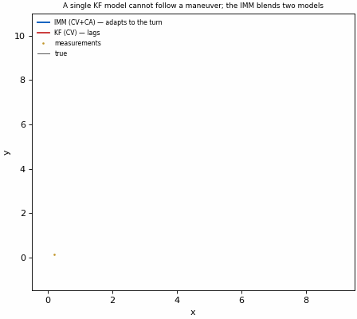
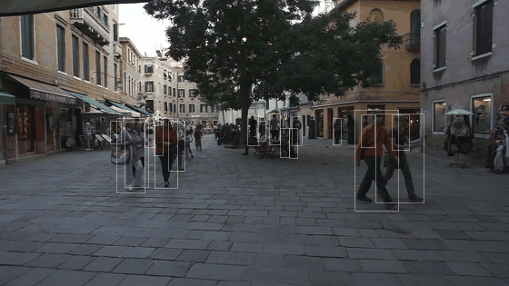

# Examples & Gallery

Seeing a filter run is the fastest way to *get* state estimation. This page
collects animated demos, copy-paste recipes, and pointers to the runnable
examples in [`examples/`](https://github.com/LakoreAI/kalbee/tree/main/examples) and [`scripts/`](https://github.com/LakoreAI/kalbee/tree/main/scripts).

Every animation below is produced with kalbee's own public API by
`scripts/generate_demo_gif.py` and `scripts/mot16_demo.py`.

> New to state estimation? Read the [intuition-first intro](learn.md) first —
> it derives the one-number case by hand and maps the math to kalbee's API.

---

## 1. Watch a Kalman filter denoise a signal

<figure>
  
  <figcaption>A constant-velocity Kalman filter removes measurement noise and
  produces a smooth position *and* velocity estimate. The blue band is the
  filter's own ±1σ uncertainty, which shrinks as measurements accumulate.</figcaption>
</figure>

```python
import numpy as np
from kalbee import KalmanFilter
from kalbee.models import constant_velocity, position_measurement_model

dt = 0.05
F, Q = constant_velocity(dt=dt, process_var=0.02, n_dims=1)      # motion model
H, R = position_measurement_model(order=1, n_dims=1, measurement_var=0.35**2)

kf = KalmanFilter(np.array([[0.0], [0.6]]), np.eye(2) * 5.0, F, Q, H, R)

for z in noisy_measurements:   # your data
    kf.predict()               # propagate: physics
    kf.update(np.array([[z]])) # correct:   evidence
    pos, vel, unc = kf.x[0, 0], kf.x[1, 0], kf.P[0, 0]
```

**The lesson:** `predict` + `update` *is* the whole filter. Everything else in
kalbee exists so you can keep that two-line loop for harder problems
(nonlinear dynamics, maneuvering targets, many objects, bad measurements).

---

## 2. One model can't follow a maneuver — blend two with IMM

<figure>
  
  <figcaption>A single constant-velocity KF lags behind a target that turns.
  The Interacting Multiple Model filter runs a slow and a fast model in
  parallel and weights them by how well each explains the measurements.</figcaption>
</figure>

```python
from kalbee import KalmanFilter, InteractingMultipleModel
from kalbee.models import constant_velocity, position_measurement_model

# two KFs on a 6-D [x, vx, y, vy, ax, ay] state: one nearly noiseless CV, one CA
cv = KalmanFilter(x0, P0, F_cv, np.eye(6) * 0.02, H, R)
ca = KalmanFilter(x0, P0, F_ca, np.eye(6) * 2.00, H, R)

imm = InteractingMultipleModel(
    [cv, ca],
    np.array([[0.97, 0.03], [0.03, 0.97]]),   # model-switch probabilities
    np.array([0.8, 0.2]),                      # prior model probabilities
)
imm.predict()
imm.update(measurement)
```

See the full maneuver scenario in
[`docs/features/maneuvering_target.md`](features/maneuvering_target.md) and
[`examples/tracking_demo.py`](https://github.com/LakoreAI/kalbee/blob/main/examples/tracking_demo.py).

---

## 3. Multi-object tracking on *real* footage (MOT Challenge)

<figure>
  
  <figcaption>Real pedestrians from the public MOT16-02 sequence. White boxes
  are the detector's boxes; colored boxes are kalbee's confirmed tracks, each
  with a stable ID that survives occlusions. Ground truth: MOT16 (Dendorfer
  et al., 2021), <a href="https://motchallenge.net">motchallenge.net</a>.</figcaption>
</figure>

Tracking many objects is *not* many Kalman filters glued by hand — kalbee
provides a SORT-style tracker that owns association and lifecycle:

```python
from kalbee import KalmanFilter, MultiObjectTracker
from kalbee.models import constant_velocity, position_measurement_model

# Each detection is a box [x1, y1, x2, y2]; track the 4 corners as CV axes.
F, Q = constant_velocity(dt=dt, process_var=1.0, n_dims=4)
H, R = position_measurement_model(order=1, n_dims=4, measurement_var=36.0)

def new_track(box):
    x0 = np.concatenate([np.array([[zi], [0.0]]) for zi in box])
    return KalmanFilter(x0, np.eye(8) * 50.0, F, Q, H, R)

tracker = MultiObjectTracker(new_track, n_init=2, max_age=30, gate=8.0)

for frame_boxes in detection_stream:
    confirmed = tracker.update(frame_boxes)      # (N,4) or None when absent
    for t in confirmed:
        print(t.id, t.state[[0, 2, 4, 6], 0])    # id + filtered box
```

Reproduce the demo yourself (downloads only MOT16-02, ~15 MB):

```bash
uv run python scripts/fetch_mot16_02.py --frames 90   # -> data/MOT16-02
uv run python examples/mot16_pedestrian_tracking.py    # console metrics
uv run python scripts/mot16_demo.py --gif              # re-render the gif
```

Detection-driven (YOLO) equivalents for vehicles and people live in
[`examples/yolo_mot.py`](https://github.com/LakoreAI/kalbee/blob/main/examples/yolo_mot.py), [`examples/yolo_vehicles.py`](https://github.com/LakoreAI/kalbee/blob/main/examples/yolo_vehicles.py) and [`examples/yolo_people.py`](https://github.com/LakoreAI/kalbee/blob/main/examples/yolo_people.py) — see
[YOLO Object Tracking](features/yolo_tracking.md).

---

## 4. Which filter should you pick?

| Your problem | Start with | Then try |
|---|---|---|
| Linear system, clean model | `KalmanFilter` | `SquareRootKalmanFilter` if long-running |
| Nonlinear dynamics / measurements | `ExtendedKalmanFilter` (have Jacobians) or `UnscentedKalmanFilter` (don't) | `CubatureKalmanFilter` for n > 5 |
| Non-Gaussian noise | `ParticleFilter` | `RaoBlackwellizedParticleFilter` if partially linear |
| Maneuvering target | `InteractingMultipleModel` (CV + CA) | `FadingMemoryKalmanFilter` (cheap alternative) |
| Unknown noise `Q` / `R` | `AdaptiveKalmanFilter` | offline `em_kalman` / `tune_kalman_filter` |
| Many objects at once | `MultiObjectTracker` | `JPDAAssociation`, `PMBMTracker` in clutter |
| Worst-case robustness | `HInfinityFilter` | — |
| Batch of independent series | `VectorizedKalmanFilter` | — |

Prefer `AutoFilter` when you want to switch strategies without rewriting the
loop:

```python
from kalbee import AutoFilter
filt = AutoFilter.from_filter(*linear_args, mode="srkf")   # or "kf","akf","hinf",...
```

---

## 5. Recipes for real workflows

### From a measurement array to a smooth output in three lines

```python
from kalbee import KalmanFilter, em_kalman
from kalbee.models import constant_velocity, position_measurement_model

F, _ = constant_velocity(dt=0.1, n_dims=1)
H, _ = position_measurement_model(order=1, n_dims=1)
result = em_kalman(measurements, F, H, n_iter=50)     # learn Q, R from data
print(result.Q, result.R)
```

### Report the numbers a reviewer will ask about

```python
from kalbee import FilterDiagnostics, rmse, nis

kf = AutoFilter.from_filter(...)
diag = FilterDiagnostics(m=1, n=2)
for z, truth in zip(stream, ground_truth):
    kf.predict(); kf.update(z)
    diag.collect(kf, truth)
report = diag.summary()          # NIS mean, covariance trace, consistency flags
```

### Reject outliers before they corrupt the state

```python
from kalbee.modules.utils.gating import chi2_gate
passed, nis_val, threshold = chi2_gate(innovation, innovation_cov, confidence=0.99)
```

---

## Where to go next

- `examples/gps_imu_fusion.py` — loosely-coupled GPS + IMU, a two-line predict loop
- `examples/quaternion_attitude_ekf.py` — attitude from gyro + accelerometer
- `examples/multi_object_tracking.py` — SORT-style MOT on synthetic detections
- `examples/yolo_*.py` — bounding-box tracking of vehicles/people in real video
- `examples/mot16_pedestrian_tracking.py` — MOT Challenge pedestrians
- `docs/features/experiments.md` — `run_experiment` to compare filters
- `docs/architecture.md` — design and how to add your own filter

All animations regenerate with:

```bash
uv run python scripts/generate_demo_gif.py   # filter + IMM demos (synthetic)
uv run python scripts/mot16_demo.py --gif    # real-video MOT demo
```
