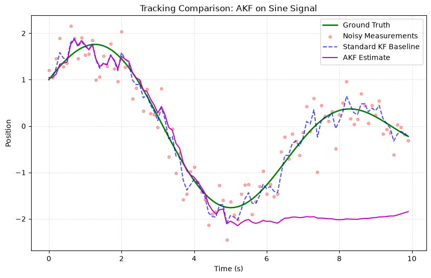
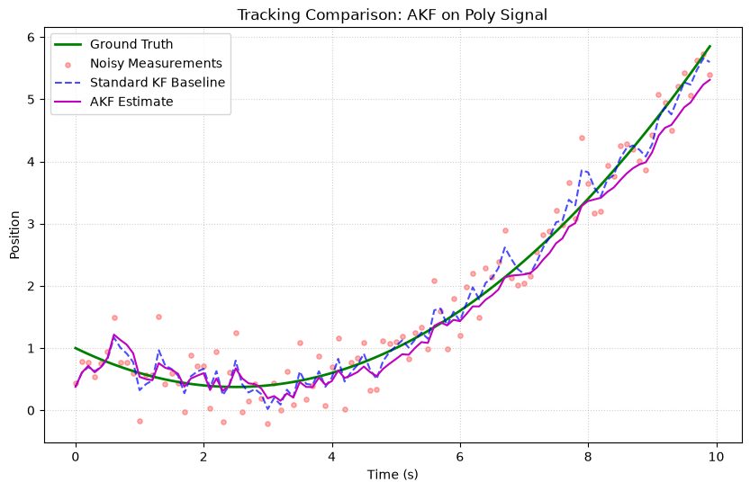
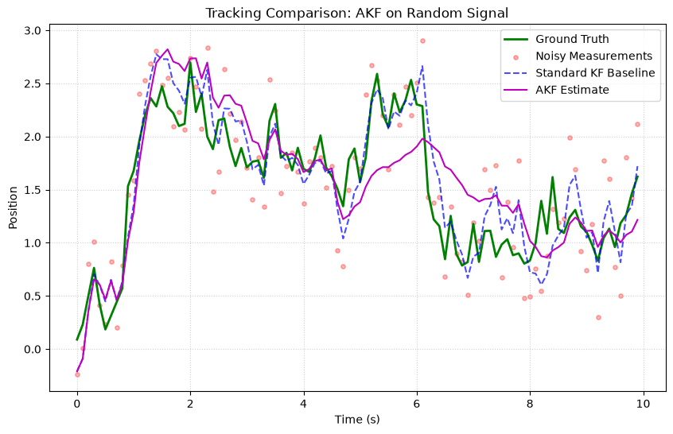

# Adaptive Kalman Filter (AKF)

The **Adaptive Kalman Filter** extends the standard KF with **online estimation of process noise ($Q$) and measurement noise ($R$)**. It automatically tunes itself based on the innovation sequence.

## Fundamental Concepts

### The Problem

In practice, $Q$ and $R$ are often unknown or time-varying. Incorrect noise parameters lead to:

- **Q too small**: Filter becomes overconfident, slow to react 
- **Q too large**: Filter is too noisy, poor smoothing
- **R too small**: Filter trusts measurements too much
- **R too large**: Filter ignores measurements

### Innovation-Based Adaptive Estimation (IAE)

The AKF monitors the **innovation sequence** (measurement residuals) and adjusts $Q$ and $R$ to keep the filter consistent:

$$C_v = \frac{1}{N} \sum_{k=1}^{N} v_k v_k^T \quad \text{(sample innovation covariance)}$$

$$\hat{R} = C_v - H P H^T$$

$$\hat{Q} = K C_v K^T$$

A **sliding window** of recent innovations keeps the estimates responsive.

### When to Use

| ✅ Use AKF when | ❌ Don't use when |
|---|---|
| True noise levels are unknown | You have calibrated Q and R (use standard KF) |
| Noise characteristics change over time | System is non-linear (use adaptive EKF manually) |
| Want a "set and forget" filter | Need guaranteed optimality |

---

## How to Use

```python
import numpy as np
from kalbee import AdaptiveKalmanFilter

state = np.array([[0.0], [0.0]])
cov = np.eye(2) * 10.0
F = np.array([[1, 1], [0, 1]])
Q = np.eye(2) * 1.0  # Initial guess (doesn't need to be accurate)
H = np.array([[1, 0]])
R = np.array([[1.0]])  # Initial guess

akf = AdaptiveKalmanFilter(
    state, cov, F, Q, H, R,
    window_size=10,    # Innovation history size
    adapt_Q=True,      # Adapt process noise
    adapt_R=True,      # Adapt measurement noise
)

# The filter will learn the true noise levels
np.random.seed(42)
true_R = 0.1  # Actual measurement noise (much smaller than our guess)

for t in range(1, 51):
    akf.predict()
    z = np.array([[float(t) + np.random.randn() * np.sqrt(true_R)]])
    akf.update(z)

print(f"Learned R: {akf.measurement_covariance[0,0]:.4f}  (True: {true_R})")
print(f"Learned Q:\n{akf.transition_covariance}")
```

### Innovation Diagnostics

```python
# Access stored innovations
innovations = akf.get_innovation_history()
print(f"Recent innovations: {len(innovations)}")
for v in innovations[-3:]:
    print(f"  {v.flatten()}")
```

---

## Run an Experiment

```python
from kalbee import run_experiment

report = run_experiment(
    signal="sine",
    filters=["kf", "akf"],
    noise_std=0.5,
    duration=10.0,
    seed=42,
)
print(report.summary())
```

!!! tip "Window Size"
    A larger `window_size` gives more stable noise estimates but slower adaptation. A smaller window adapts faster but with more variance. Start with 10–20 for most applications.

---

## Simulation Results

Here is the tracking performance of the Adaptive Kalman Filter (AKF) compared against the Standard Kalman Filter baseline on three different signal trajectories:

### 1. Sine/Cosine Signal


* **Analysis**: The Adaptive KF (AKF) estimates process noise $Q$ and measurement noise $R$ dynamically. On the sine wave, it adjusts covariance scaling to track peaks more responsively compared to the fixed-gain standard KF baseline.

### 2. Polynomial (Degree 2) Signal


* **Analysis**: As the target accelerates on the quadratic curve, the AKF detects the increasing residuals, scales up its process noise estimate, and reduces the steady-state lag relative to the baseline KF.

### 3. Random Walk Signal


* **Analysis**: The AKF adapts to local noise shifts stably, maintaining a smooth path without losing track of the true state's random drift.
