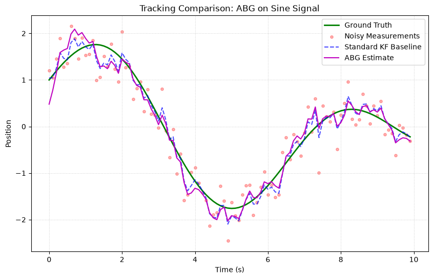
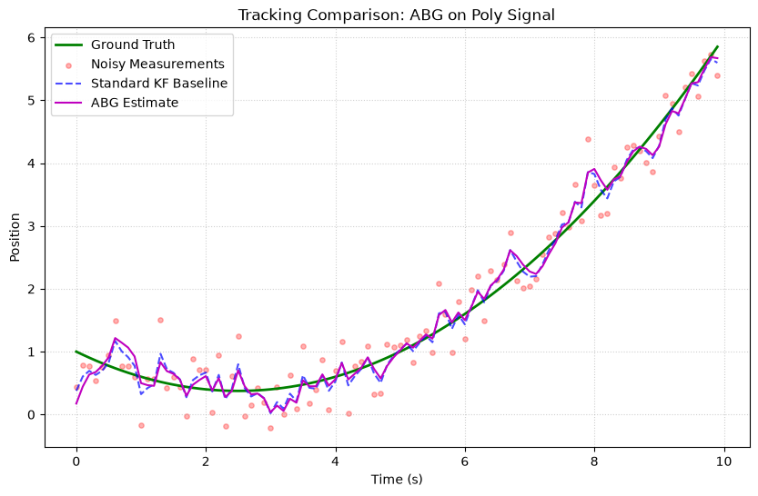
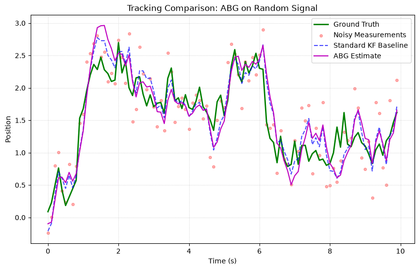

# Alpha-Beta-Gamma Filter (ABG)

The **Alpha-Beta-Gamma Filter** is a lightweight, fixed-gain filter for tracking position, velocity, and acceleration. It's the simplest filter in kalbee — no matrices, no inversions, just three tuning parameters.

## Fundamental Concepts

### The Idea

The ABG filter is a simplified form of the Kalman Filter where the **gains are fixed** rather than computed optimally at each step. It uses three gain parameters:

- **α** (alpha) — position correction gain
- **β** (beta) — velocity correction gain  
- **γ** (gamma) — acceleration correction gain

### The Algorithm

**Predict** (kinematic model):

$$
\begin{aligned}
\hat{x}_k &= \hat{x}_{k-1} + \hat{v}_{k-1} \cdot dt + \frac{1}{2} \hat{a}_{k-1} \cdot dt^2 \\
\hat{v}_k &= \hat{v}_{k-1} + \hat{a}_{k-1} \cdot dt \\
\hat{a}_k &= \hat{a}_{k-1}
\end{aligned}
$$

**Update** (apply corrections using residual $r = z - \hat{x}$):

$$
\begin{aligned}
x_k &= \hat{x}_k + \alpha \cdot r \\
v_k &= \hat{v}_k + \frac{\beta}{dt} \cdot r \\
a_k &= \hat{a}_k + \frac{\gamma}{2 \cdot dt^2} \cdot r
\end{aligned}
$$

### Gain Tuning Guidelines

| Gains | Behavior |
|---|---|
| High α, β, γ | Fast response, noisy estimates |
| Low α, β, γ | Smooth estimates, slow response |
| α = 1, β = 0, γ = 0 | Pure position tracking (no prediction) |

### When to Use

| ✅ Use ABG when | ❌ Don't use when |
|---|---|
| Low-compute environment | Need optimal estimation (use KF) |
| Simple kinematic tracking | System is non-linear |
| Fixed gains are acceptable | Need adaptive noise estimation |
| Quick prototyping | Multi-dimensional state space |

---

## How to Use

```python
import numpy as np
from kalbee import AlphaBetaGammaFilter

# State: [position, velocity, acceleration]
state = np.array([[0.0], [0.0], [0.0]])

# Tuning gains
alpha = 0.5    # Position correction
beta = 0.4     # Velocity correction
gamma = 0.1    # Acceleration correction

abg = AlphaBetaGammaFilter(state, alpha, beta, gamma)

# Track a target
dt = 1.0
measurements = [1.0, 2.0, 3.1, 3.9, 5.1, 6.0, 7.2, 7.8, 9.1, 10.0]

for z in measurements:
    abg.predict(dt=dt)
    abg.update(np.array([[z]]), dt=dt)
    pos, vel, acc = abg.x.flatten()
    print(f"Measurement: {z:.1f}  "
          f"Position: {pos:.2f}  Velocity: {vel:.2f}  Accel: {acc:.3f}")
```

!!! tip "Interface Difference"
    Unlike other filters, the ABG `update()` takes an additional `dt` parameter because the gain corrections depend on the time step.

---

## Run an Experiment

The ABG filter is not included in the experiment runner by default (it uses a different state model). You can test it manually:

```python
import numpy as np
from kalbee import AlphaBetaGammaFilter

state = np.array([[0.0], [0.0], [0.0]])
abg = AlphaBetaGammaFilter(state, alpha=0.8, beta=0.5, gamma=0.1)

# Generate sine signal
t = np.arange(0, 10, 0.1)
true_pos = np.sin(t)
noise = np.random.randn(len(t)) * 0.3

errors = []
for i in range(len(t)):
    abg.predict(dt=0.1)
    abg.update(np.array([[true_pos[i] + noise[i]]]), dt=0.1)
    errors.append(abs(abg.x[0, 0] - true_pos[i]))

print(f"Average error: {np.mean(errors):.4f}")
```

---

## Simulation Results

Here is the tracking performance of the Alpha-Beta-Gamma Filter (ABG) compared against the Standard Kalman Filter baseline on three different signal trajectories:

### 1. Sine/Cosine Signal


* **Analysis**: The ABG filter uses fixed gains ($\alpha=0.4, \beta=0.1, \gamma=0.01$). It behaves as a simple smooth tracking filter, lagging slightly behind the adaptive Standard KF baseline which changes its Kalman Gain dynamically based on covariance propagation.

### 2. Polynomial (Degree 2) Signal


* **Analysis**: Since the ABG models acceleration with a constant gain factor, it tracks the quadratic curve with less lag than the standard Constant Velocity KF baseline, proving its effectiveness for constant acceleration profiles when properly tuned.

### 3. Random Walk Signal


* **Analysis**: The ABG filter tracks the random walk smoothly, but shows slightly larger deviations than the standard KF since its static gains cannot adapt to changing state uncertainties.
