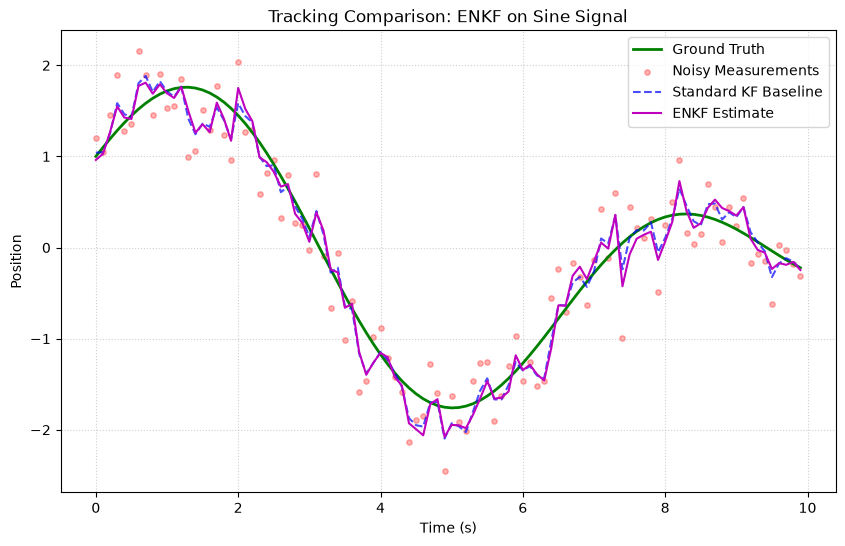
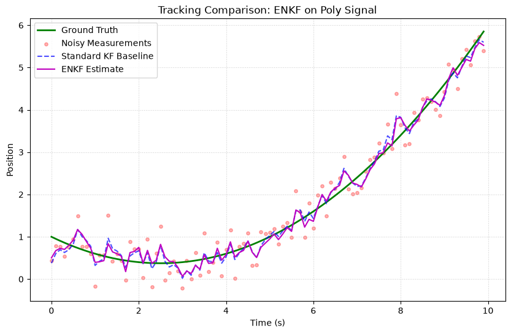
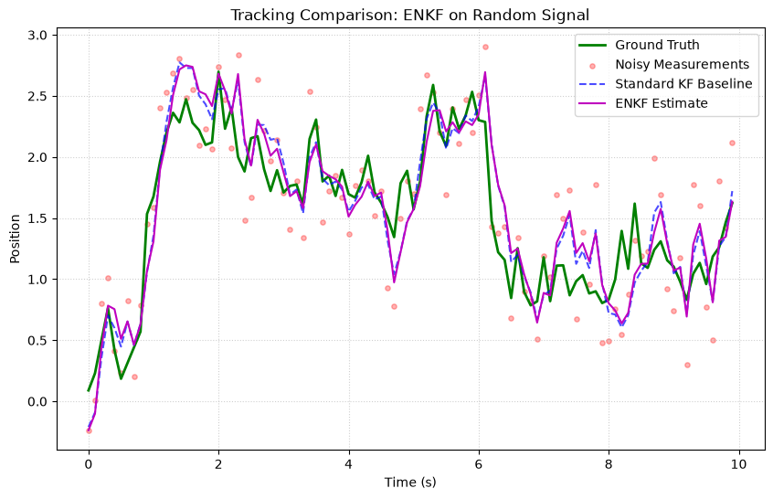

# Ensemble Kalman Filter (EnKF)

The **Ensemble Kalman Filter** uses an **ensemble of state vectors** to represent the probability distribution, computing the Kalman gain from **sample covariances**. It is ideal for **high-dimensional** systems where maintaining a full covariance matrix is impractical.

## Fundamental Concepts

### The Idea

Instead of tracking a single state + full covariance matrix ($n \times n$), the EnKF maintains $N$ ensemble members (state samples). Statistics are computed from the ensemble:

$$\hat{x} = \frac{1}{N} \sum_{i=1}^{N} x^{(i)} \quad \text{(ensemble mean)}$$

$$P \approx \frac{1}{N-1} \sum_{i=1}^{N} (x^{(i)} - \hat{x})(x^{(i)} - \hat{x})^T \quad \text{(sample covariance)}$$

### The Algorithm

**Predict**: Propagate each ensemble member + add noise

$$x^{(i)}_{k|k-1} = f(x^{(i)}_{k-1}, dt) + w^{(i)}_k, \quad w^{(i)} \sim \mathcal{N}(0, Q)$$

**Update** (Stochastic EnKF): Perturb observations and update each member

$$
\begin{aligned}
K &= P_{xz} P_{zz}^{-1} \\
x^{(i)}_k &= x^{(i)}_{k|k-1} + K (z + \epsilon^{(i)} - h(x^{(i)}_{k|k-1}))
\end{aligned}
$$

where $\epsilon^{(i)} \sim \mathcal{N}(0, R)$ are observation perturbations.

### When to Use

| ✅ Use EnKF when | ❌ Don't use when |
|---|---|
| State dimension is high ($n > 10$) | State dimension is small (UKF is more accurate) |
| Full covariance is too expensive | Need exact Bayesian solution (use PF) |
| System is non-linear | Noise is strongly non-Gaussian |

---

## How to Use

```python
import numpy as np
from kalbee import EnsembleKalmanFilter

state = np.array([[0.0], [0.0]])
cov = np.eye(2) * 10.0
Q = np.eye(2) * 0.01
R = np.eye(1) * 0.5

def transition(x, dt):
    F = np.array([[1, dt], [0, 1]])
    return F @ x

def measurement(x):
    return x[:1]  # Observe position

enkf = EnsembleKalmanFilter(
    state, cov, Q, R,
    transition_function=transition,
    measurement_function=measurement,
    ensemble_size=100,
)

np.random.seed(42)
for t in range(1, 11):
    enkf.predict(dt=1.0)
    z = np.array([[float(t) + np.random.randn() * 0.5]])
    enkf.update(z)
    print(f"True: {t}  Estimated: {enkf.x[0,0]:.2f}")
```

---

## Run an Experiment

```python
from kalbee import run_experiment

report = run_experiment(
    signal="sine",
    filters=["kf", "ukf", "enkf"],
    noise_std=0.3,
    duration=10.0,
    seed=42,
)
print(report.summary())
```

!!! note "Ensemble Size"
    The experiment runner uses 100 ensemble members by default. Increasing this improves accuracy but slows execution. For most problems, 50–200 is sufficient.

---

## Simulation Results

Here is the tracking performance of the Ensemble Kalman Filter (EnKF) compared against the Standard Kalman Filter baseline on three different signal trajectories:

### 1. Sine/Cosine Signal


* **Analysis**: The EnKF propagates an ensemble of 30 members. Due to this sample-based covariance approximation, its trajectory displays slightly more fluctuations compared to the analytical Standard KF baseline.

### 2. Polynomial (Degree 2) Signal


* **Analysis**: EnKF follows the quadratic curve but is bounded by the same constant-velocity model lag as the standard KF. The ensemble mean matches the baseline track.

### 3. Random Walk Signal


* **Analysis**: EnKF tracks the stochastic walk smoothly, confirming that ensemble covariance estimation scales stably under random noise perturbations.
