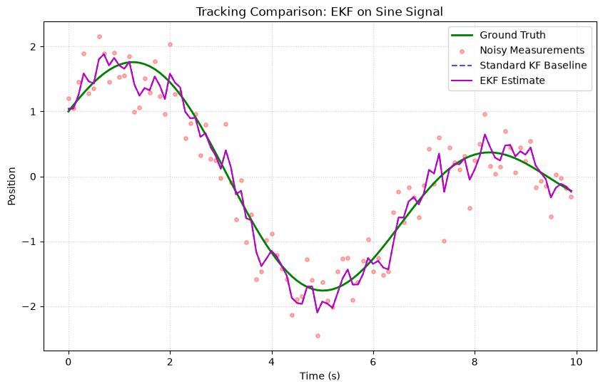
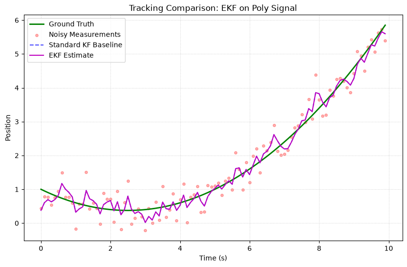
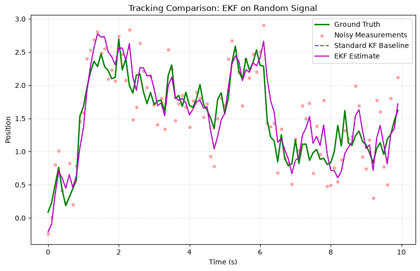

# Extended Kalman Filter (EKF)

The **Extended Kalman Filter** extends the standard KF to handle **non-linear** systems by linearizing the dynamics using **Jacobian** matrices at each time step.

## Fundamental Concepts

### The Problem

Real-world systems are often non-linear:

$$x_k = f(x_{k-1}, dt) + w_k \quad \text{(non-linear transition)}$$

$$z_k = h(x_k) + v_k \quad \text{(non-linear measurement)}$$

Where $f$ and $h$ are **non-linear functions**. The standard KF cannot handle this directly because it assumes linearity.

### The Solution: Linearization

The EKF approximates the non-linear functions using a **first-order Taylor expansion** around the current estimate:

$$f(x) \approx f(\hat{x}) + F (x - \hat{x})$$

Where $F = \frac{\partial f}{\partial x}\bigg|_{\hat{x}}$ is the **Jacobian matrix**.

### The Algorithm

**Predict:**

$$
\begin{aligned}
\hat{x}_{k|k-1} &= f(\hat{x}_{k-1}, dt) \\
P_{k|k-1} &= F_k P_{k-1} F_k^T + Q
\end{aligned}
$$

**Update:**

$$
\begin{aligned}
K_k &= P_{k|k-1} H_k^T (H_k P_{k|k-1} H_k^T + R)^{-1} \\
\hat{x}_k &= \hat{x}_{k|k-1} + K_k (z_k - h(\hat{x}_{k|k-1})) \\
P_k &= (I - K_k H_k) P_{k|k-1} (I - K_k H_k)^T + K_k R K_k^T
\end{aligned}
$$

!!! warning "Jacobian Required"
    The EKF requires you to compute Jacobians ($F$ and $H$) analytically. If your system is highly non-linear, this linearization can introduce significant error — consider using the **UKF** instead.

### When to Use

| ✅ Use EKF when | ❌ Don't use when |
|---|---|
| System is mildly non-linear | System is highly non-linear (use UKF) |
| You can compute Jacobians | Jacobians are hard to derive (use UKF) |
| Noise is Gaussian | Noise is non-Gaussian (use PF) |
| Need to be close to the standard KF | — |

---

## How to Use

### Example: Non-linear Measurement ($z = x^2$)

```python
import numpy as np
from kalbee import ExtendedKalmanFilter

# State: single variable
state = np.array([[2.0]])
covariance = np.eye(1) * 1.0
Q = np.eye(1) * 0.01
R = np.eye(1) * 0.1

# Non-linear functions
def f(x, dt):
    """State transition: constant state."""
    return x

def F_jacobian(x, dt):
    """Jacobian of f: df/dx = I."""
    return np.array([[1.0]])

def h(x):
    """Measurement function: z = x^2."""
    return x ** 2

def H_jacobian(x):
    """Jacobian of h: dh/dx = 2x."""
    return np.array([[2 * x[0, 0]]])

# Initialize EKF
ekf = ExtendedKalmanFilter(
    state, covariance, Q, R,
    transition_function=f,
    measurement_function=h,
    transition_jacobian=F_jacobian,
    measurement_jacobian=H_jacobian,
)

# Simulate
np.random.seed(42)
true_state = 2.0

for _ in range(10):
    ekf.predict(dt=1.0)
    z = np.array([[true_state**2 + np.random.randn() * 0.1]])
    ekf.update(z)
    print(f"True: {true_state:.2f}  Estimated: {ekf.x[0,0]:.4f}")
```

### Passing Functions via kwargs

You can also pass functions dynamically:

```python
ekf = ExtendedKalmanFilter(state, covariance, Q, R)

# Pass functions at call time
ekf.predict(dt=0.1, f=my_transition, F=my_jacobian)
ekf.update(measurement, h=my_measurement, H=my_meas_jacobian)
```

---

## Run an Experiment

```python
from kalbee import run_experiment

# Compare EKF with other filters on a sine wave
report = run_experiment(
    signal="sine",
    filters=["kf", "ekf", "ukf"],
    noise_std=0.3,
    duration=10.0,
    seed=42,
)
print(report.summary())
```

!!! tip "EKF vs KF"
    On the sine signal, the EKF typically performs similarly to the KF because the experiment runner uses a constant-velocity model. The EKF's advantage shows when you have genuinely **non-linear dynamics** that cannot be captured by a linear $F$ matrix.

---

## Simulation Results

Here is the tracking performance of the Extended Kalman Filter (EKF) compared against the Standard Kalman Filter baseline on three different signal trajectories:

### 1. Sine/Cosine Signal


* **Analysis**: Because the underlying transition and measurement functions in this experiment are linear, the EKF performs identically to the standard KF baseline.

### 2. Polynomial (Degree 2) Signal


* **Analysis**: The EKF tracks the quadratic curve with the same steady-state lag as the baseline KF, confirming that the linearization step behaves correctly under linear models.

### 3. Random Walk Signal


* **Analysis**: The EKF path is superimposed on the standard KF baseline, demonstrating consistent smoothing performance for stochastic signals.
