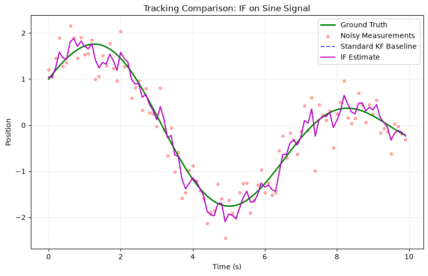
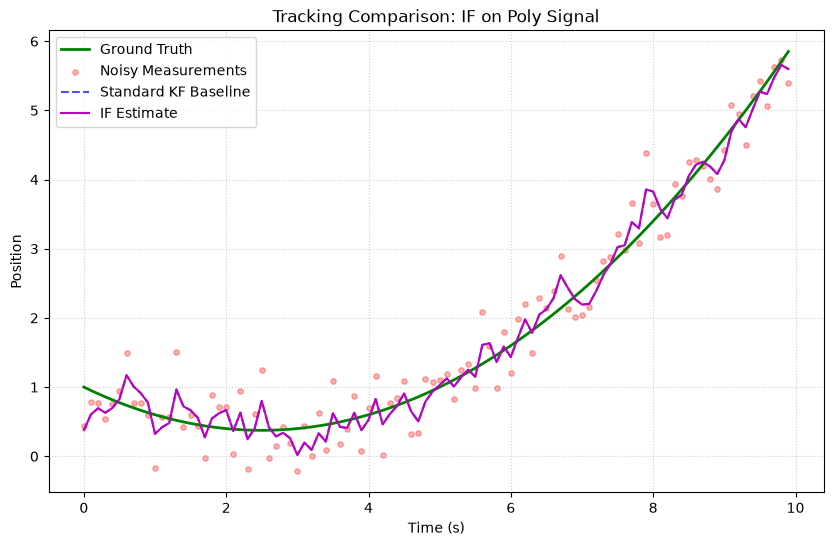
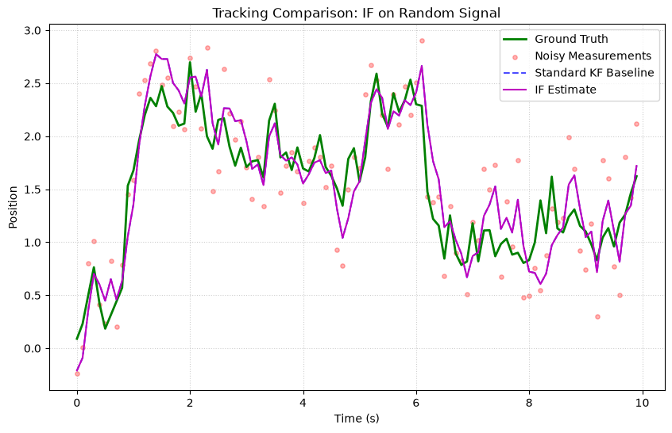

# Information Filter (IF)

The **Information Filter** is the algebraic dual of the Kalman Filter. It operates in **information space** using the **information matrix** $Y = P^{-1}$ and **information state** $\hat{y} = P^{-1}x$, making multi-sensor fusion trivially simple.

## Fundamental Concepts

### Dual Representation

| Standard KF | Information Filter |
|---|---|
| State $x$ | Information state $\hat{y} = P^{-1}x$ |
| Covariance $P$ | Information matrix $Y = P^{-1}$ |
| Larger $P$ = more uncertain | Larger $Y$ = more certain |

### Key Advantage: Additive Update

In the standard KF, the update involves matrix inversion. In the IF, the measurement update is **purely additive**:

$$
\begin{aligned}
Y_k &= Y_{k|k-1} + H^T R^{-1} H \\
\hat{y}_k &= \hat{y}_{k|k-1} + H^T R^{-1} z
\end{aligned}
$$

This means **multi-sensor fusion** is simply addition — no complex matrix algebra needed!

### When to Use

| ✅ Use IF when | ❌ Don't use when |
|---|---|
| Fusing data from multiple sensors | Only one sensor (KF is simpler) |
| Distributed sensor networks | Prior is very uncertain ($P^{-1}$ may not exist) |
| Want simple fusion math | System is non-linear (use EKF/UKF) |

---

## How to Use

### Basic Example

```python
import numpy as np
from kalbee import InformationFilter

state = np.array([[0.0], [0.0]])
cov = np.eye(2) * 10.0
F = np.array([[1, 1], [0, 1]])
Q = np.eye(2) * 0.01
H = np.array([[1.0, 0.0]])
R = np.array([[0.5]])

inf = InformationFilter(state, cov, F, Q, H, R)

# Predict & update — same interface as KF
for t in range(1, 6):
    inf.predict()
    inf.update(np.array([[float(t)]]))
    print(f"State: {inf.x[0,0]:.2f}  Info matrix trace: {np.trace(inf.Y):.2f}")
```

### Multi-Sensor Fusion

The killer feature — fuse information from external sources:

```python
# Main filter with sensor 1
inf = InformationFilter(state, cov, F, Q, H, R)
inf.predict()
inf.update(np.array([[5.0]]))  # Sensor 1 measurement

# Sensor 2 provides its own information contribution
sensor2_info_matrix = H.T @ np.linalg.inv(R) @ H   # H'R^{-1}H
sensor2_info_state = H.T @ np.linalg.inv(R) @ np.array([[5.1]])  # H'R^{-1}z

# Fuse — it's just addition!
inf.fuse(sensor2_info_matrix, sensor2_info_state)
print(f"Fused state: {inf.x[0,0]:.2f}")
print(f"Fused covariance: {inf.P[0,0]:.4f}")  # Lower = more certain
```

---

## Run an Experiment

```python
from kalbee import run_experiment

report = run_experiment(
    signal="linear",
    filters=["kf", "if"],  # Compare KF and IF
    noise_std=0.3,
    duration=10.0,
    seed=42,
)
print(report.summary())
# They should give nearly identical results (they're mathematically dual)
```

!!! note "KF ≡ IF"
    The Information Filter and Kalman Filter are mathematically equivalent — they produce the **same estimates**. The difference is computational: the IF is more efficient for multi-sensor fusion, while the KF is simpler for single-sensor systems.

---

## Simulation Results

Here is the tracking performance of the Information Filter (IF) compared against the Standard Kalman Filter baseline on three different signal trajectories:

### 1. Sine/Cosine Signal


* **Analysis**: As the mathematical dual of the Kalman Filter, the Information Filter (IF) produces identical trajectory estimates to the Standard KF baseline.

### 2. Polynomial (Degree 2) Signal


* **Analysis**: The IF exhibits the same tracking lag during acceleration phases, since it shares the linear constant-velocity state space representation.

### 3. Random Walk Signal


* **Analysis**: The IF matches the standard KF baseline exactly under random walk drift, demonstrating correct algebraic equivalence in information space.
