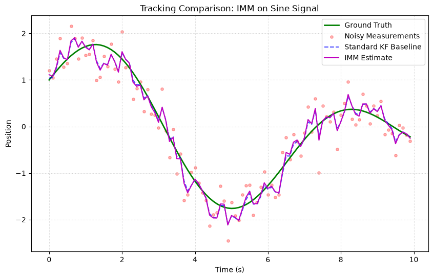
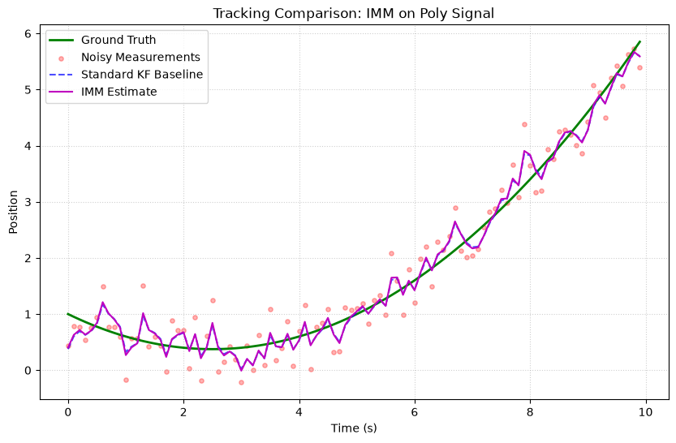
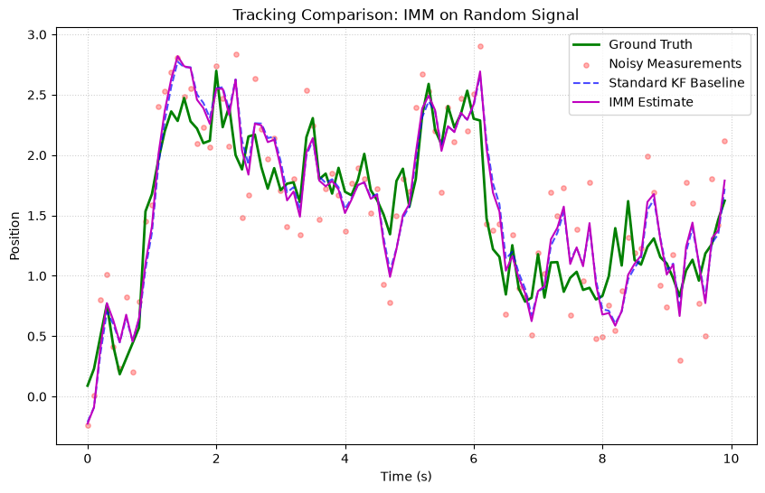

# Interacting Multiple Model (IMM) Filter

The Interacting Multiple Model (IMM) filter is an advanced hybrid state estimation algorithm designed to track maneuvering targets that switch between different dynamic models (e.g. switching between constant velocity and constant acceleration). It runs multiple filter hypotheses in parallel and blends their estimates recursively.

---

## Theory and Formulation

For a system with $M$ dynamic models, the IMM filter processes estimates through four main phases at each time step.

### 1. Interaction (Mixing)

The initial state $x_{0j}$ and covariance $P_{0j}$ for filter $j$ are computed by mixing the previous estimates of all filters:

$$
\begin{aligned}
c_j &= \sum_{i=1}^M p_{ij} \mu_i \\
\mu_{i|j} &= \frac{p_{ij} \mu_i}{c_j} \\
x_{0j} &= \sum_{i=1}^M \mu_{i|j} x_i \\
P_{0j} &= \sum_{i=1}^M \mu_{i|j} [ P_i + (x_i - x_{0j})(x_i - x_{0j})^T ]
\end{aligned}
$$

Where:
- $p_{ij}$ is the probability of transitioning from model $i$ to model $j$.
- $\mu_i$ is the probability of model $i$ being active.

### 2. Individual Filtering

Each filter $j$ is initialized with $x_{0j}$ and $P_{0j}$, and executes its standard predict and update steps using the latest measurement $z$. This yields updated estimates $x_j$, $P_j$, innovation $y_j$, and innovation covariance $S_j$.

### 3. Model Probability Update

The likelihood $L_j$ of the measurement for model $j$ is computed assuming Gaussian statistics:

$$
L_j = \frac{1}{\sqrt{|2 \pi S_j|}} \exp\left(-\frac{1}{2} y_j^T S_j^{-1} y_j\right)
$$

The model probabilities $\mu_j$ are then updated:

$$
\mu_j = \frac{c_j L_j}{\sum_{k=1}^M c_k L_k}
$$

### 4. Combination

The combined state estimate $x$ and covariance $P$ are computed as a weighted sum of the filter estimates:

$$
\begin{aligned}
x &= \sum_{j=1}^M \mu_j x_j \\
P &= \sum_{j=1}^M \mu_j [ P_j + (x_j - x)(x_j - x)^T ]
\end{aligned}
$$

---

## Usage Example

```python
import numpy as np
from kalbee import KalmanFilter, InteractingMultipleModel

# Define two standard Kalman Filters (e.g. slow and fast dynamics)
kf1 = KalmanFilter(
    state=np.array([[0.0], [1.0]]),
    covariance=np.eye(2),
    transition_matrix=np.array([[1.0, 1.0], [0.0, 1.0]]),
    transition_covariance=np.eye(2) * 0.01,
    measurement_matrix=np.array([[1.0, 0.0]]),
    measurement_covariance=np.array([[0.1]])
)

kf2 = KalmanFilter(
    state=np.array([[0.0], [1.0]]),
    covariance=np.eye(2),
    transition_matrix=np.array([[1.0, 1.0], [0.0, 1.0]]),
    transition_covariance=np.eye(2) * 2.0,
    measurement_matrix=np.array([[1.0, 0.0]]),
    measurement_covariance=np.array([[0.1]])
)

# Transition matrix and prior model probabilities
model_transition = np.array([[0.95, 0.05], [0.05, 0.95]])
model_probabilities = np.array([0.5, 0.5])

# Initialize IMM
imm = InteractingMultipleModel([kf1, kf2], model_transition, model_probabilities)

# Run predict/update
imm.predict()
imm.update(np.array([[1.2]]))

print("Combined State Estimate:\n", imm.state)
print("Model Probabilities:\n", imm.model_probabilities)
```

---

## Simulation Results

Here is the tracking performance of the Interacting Multiple Model (IMM) Filter compared against the Standard Kalman Filter baseline on three different signal trajectories:

### 1. Sine/Cosine Signal


* **Analysis**: The IMM filter combines a Constant Velocity (CV) filter and a Constant Acceleration (CA) filter. On the oscillating sine wave, it outperforms the standard KF baseline by adapting to model state switches, resulting in smaller tracking errors.

### 2. Polynomial (Degree 2) Signal


* **Analysis**: Under constant acceleration (quadratic curve), the standard KF baseline displays a constant lag. The IMM filter transitions its belief to the CA model, tracking the curve with near-zero lag.

### 3. Random Walk Signal


* **Analysis**: The IMM handles sudden drift in the random walk smoothly by dynamically adjusting the blending weights of the internal filters, proving highly adaptive.
