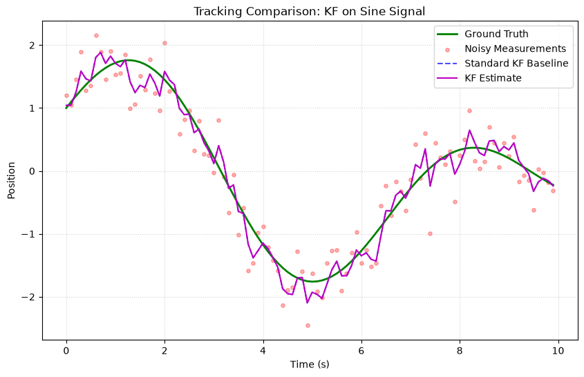
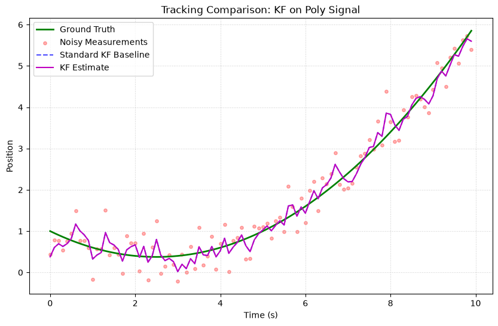
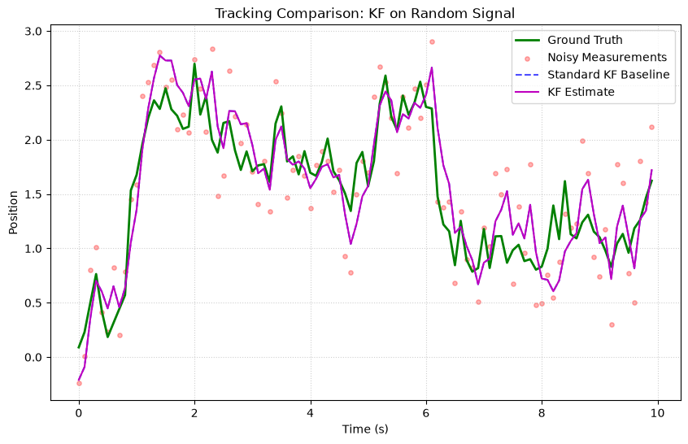

# Kalman Filter (KF)

The **Standard Kalman Filter** is the foundational algorithm for state estimation in **linear** systems with **Gaussian** noise. It is optimal in the minimum mean-square error sense.

## Fundamental Concepts

### The Problem

You have a system that evolves over time:

$$x_k = F x_{k-1} + w_k \quad \text{(state transition)}$$

$$z_k = H x_k + v_k \quad \text{(measurement)}$$

Where:

- $x_k$ is the **state** (what you want to estimate, e.g., position + velocity)
- $z_k$ is the **measurement** (what your sensor reads)
- $F$ is the **transition matrix** (how state evolves)
- $H$ is the **measurement matrix** (what you observe from the state)
- $w_k \sim \mathcal{N}(0, Q)$ is **process noise**
- $v_k \sim \mathcal{N}(0, R)$ is **measurement noise**

### The Algorithm

The KF operates in two steps each cycle:

**Predict** — project state forward:

$$
\begin{aligned}
\hat{x}_{k|k-1} &= F \hat{x}_{k-1} \\
P_{k|k-1} &= F P_{k-1} F^T + Q
\end{aligned}
$$

**Update** — correct with measurement:

$$
\begin{aligned}
K_k &= P_{k|k-1} H^T (H P_{k|k-1} H^T + R)^{-1} \\
\hat{x}_k &= \hat{x}_{k|k-1} + K_k (z_k - H \hat{x}_{k|k-1}) \\
P_k &= (I - K_k H) P_{k|k-1} (I - K_k H)^T + K_k R K_k^T
\end{aligned}
$$

!!! note "Joseph Form"
    kalbee uses the **Joseph form** for the covariance update (last equation). This is more numerically stable than the simpler $P = (I-KH)P$, preventing $P$ from losing symmetry or positive-definiteness.

### When to Use

| ✅ Use KF when | ❌ Don't use when |
|---|---|
| System dynamics are linear | Dynamics are non-linear (use EKF/UKF) |
| Noise is Gaussian | Noise is non-Gaussian (use Particle Filter) |
| You know F, H, Q, R | Model is unknown or switches (use Adaptive KF) |
| Real-time performance needed | — |

---

## How to Use

### Basic Example: Tracking Position and Velocity

```python
import numpy as np
from kalbee import KalmanFilter

# State: [position, velocity]
state = np.array([[0.0], [0.0]])
covariance = np.eye(2) * 10.0  # High initial uncertainty

# Constant-velocity model
dt = 1.0
F = np.array([[1.0, dt],
              [0.0, 1.0]])   # position += velocity * dt
Q = np.eye(2) * 0.01          # Small process noise
H = np.array([[1.0, 0.0]])    # Measure position only
R = np.array([[0.5]])          # Measurement noise variance

kf = KalmanFilter(state, covariance, F, Q, H, R)

# Simulate noisy measurements of a target moving at velocity 1.0
true_positions = [1.0, 2.0, 3.0, 4.0, 5.0, 6.0, 7.0, 8.0, 9.0, 10.0]
np.random.seed(42)

for pos in true_positions:
    kf.predict(dt=dt)
    z = np.array([[pos + np.random.randn() * 0.5]])  # Noisy measurement
    kf.update(z)
    print(f"True: {pos:.1f}  Measured: {z[0,0]:.2f}  "
          f"Estimated: {kf.x[0,0]:.2f}  Velocity: {kf.x[1,0]:.2f}")
```

### Using Properties

```python
# Access state and covariance via properties
print(kf.x)     # State estimate (same as kf.state)
print(kf.P)     # Covariance (same as kf.covariance)

# Map state to measurement space
expected_measurement = kf.measure()
```

---

## Run an Experiment

Compare the Kalman Filter against other filters on a synthetic curve:

```python
from kalbee import run_experiment

report = run_experiment(
    signal="sine",                  # Track a sine wave
    filters=["kf", "ekf", "ukf"],  # Compare these filters
    noise_std=0.5,                  # Measurement noise level
    duration=10.0,
    seed=42,
)
print(report.summary())

# Access individual result
kf_result = report.results[0]
print(f"KF Position RMSE: {kf_result.position_rmse():.4f}")
print(f"KF Velocity RMSE: {kf_result.velocity_rmse():.4f}")
```

!!! tip "Signal Options"
    Try different signals: `"sine"`, `"cosine"`, `"linear"`, `"step"` to see how the KF handles different dynamics. The KF excels on **linear** signals (constant velocity) but struggles with non-linear oscillations.

---

## Simulation Results

Here is the tracking performance of the Standard Kalman Filter (KF) compared against the baseline on three different signal trajectories:

### 1. Sine/Cosine Signal


* **Analysis**: The standard KF tracks the oscillating sine wave with a small phase lag. Because the transition model assumes a constant velocity, it cannot predict the changing acceleration at the peaks and troughs.

### 2. Polynomial (Degree 2) Signal


* **Analysis**: Under constant acceleration (quadratic curve), the CV Kalman Filter shows a steady-state lag. The estimated position lags behind the true position because the acceleration parameter is not modeled.

### 3. Random Walk Signal


* **Analysis**: The filter smooths out the high-frequency measurement noise while following the random drift of the true state, acting as a balanced low-pass filter.
