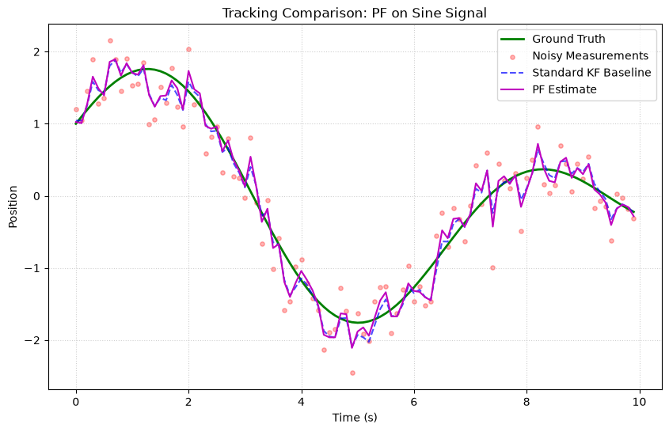
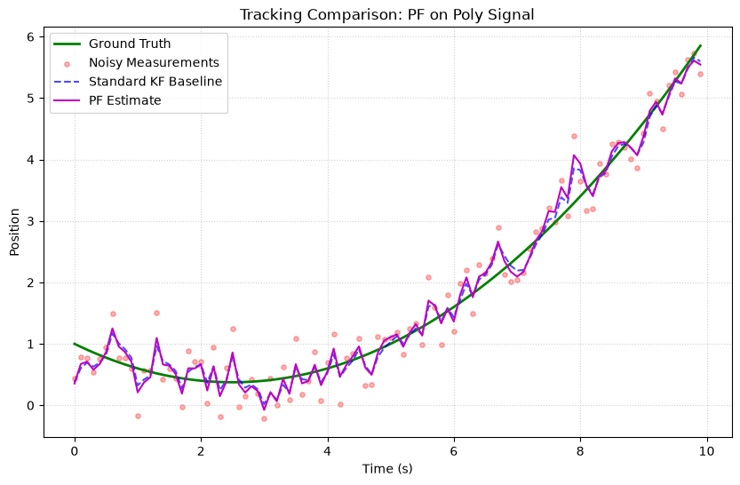
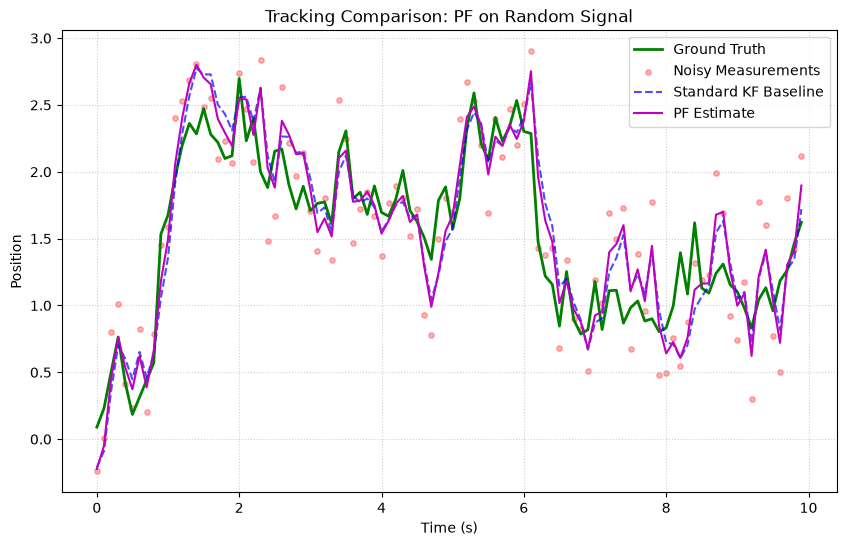

# Particle Filter (PF)

The **Particle Filter** (Sequential Monte Carlo) is the most general filter in kalbee. It handles **non-linear** dynamics with **non-Gaussian** noise distributions by representing the state probability as a set of weighted particles.

## Fundamental Concepts

### The Idea

Instead of representing the state as a single point + covariance (like KF), the Particle Filter uses **many sample points (particles)**, each representing a possible state:

$$p(x_k) \approx \sum_{i=1}^{N} w_k^{(i)} \delta(x_k - x_k^{(i)})$$

Where $x_k^{(i)}$ are particles and $w_k^{(i)}$ are their weights.

### The Algorithm

1. **Initialize**: Draw $N$ particles from the prior distribution
2. **Predict**: Propagate each particle through the transition function + noise
3. **Update**: Weight each particle by how well it explains the measurement
4. **Resample**: Replace low-weight particles with copies of high-weight ones

### Resampling

Without resampling, particle weights degenerate — eventually only one particle has significant weight. kalbee uses **systematic resampling** which:

- Is $O(N)$ (very fast)
- Produces low-variance samples
- Triggers automatically when $N_{\text{eff}} < \text{threshold} \times N$

The **effective sample size** is:

$$N_{\text{eff}} = \frac{1}{\sum_{i=1}^{N} (w^{(i)})^2}$$

### When to Use

| ✅ Use PF when | ❌ Don't use when |
|---|---|
| Noise is non-Gaussian | State dimension is high ($n > 5$, curse of dimensionality) |
| System is highly non-linear | Real-time speed is critical (many particles = slow) |
| Multi-modal distributions | Simple linear system (KF is much faster) |
| No closed-form model needed | — |

---

## How to Use

### Basic Example

```python
import numpy as np
from kalbee import ParticleFilter

state = np.array([[0.0]])
covariance = np.eye(1) * 5.0
R = np.eye(1) * 0.5

def transition(x, dt):
    return x + dt  # Constant velocity

def measurement(x):
    return x  # Directly observe position

pf = ParticleFilter(
    state=state,
    covariance=covariance,
    transition_function=transition,
    measurement_function=measurement,
    measurement_covariance=R,
    num_particles=1000,
    resample_threshold=0.5,
)

# Track
np.random.seed(42)
for t in range(1, 11):
    pf.predict(dt=1.0)
    z = np.array([[float(t) + np.random.randn() * 0.5]])
    pf.update(z)
    print(f"True: {t}  Estimated: {pf.x[0,0]:.2f}")
```

### Custom Noise Function

Control the process noise distribution:

```python
def my_noise(num_particles):
    """Non-Gaussian noise: mixture of two Gaussians."""
    noise = np.zeros((num_particles, 1))
    for i in range(num_particles):
        if np.random.rand() < 0.5:
            noise[i] = np.random.randn() * 0.1
        else:
            noise[i] = np.random.randn() * 1.0 + 3.0
    return noise

pf = ParticleFilter(
    state=state,
    covariance=covariance,
    transition_function=transition,
    measurement_function=measurement,
    measurement_covariance=R,
    noise_function=my_noise,
    num_particles=2000,
)
```

### Diagnostics

```python
# Check particle health
n_eff = pf._effective_particles()
print(f"Effective particles: {n_eff:.0f} / {pf.num_particles}")
```

---

## Run an Experiment

```python
from kalbee import run_experiment

report = run_experiment(
    signal="step",                     # Step signal tests adaptation
    filters=["kf", "pf", "ukf"],
    noise_std=0.3,
    duration=10.0,
    seed=42,
)
print(report.summary())
```

!!! tip "Particle Count"
    In the experiment runner, the PF uses 500 particles by default. For higher-dimensional problems, increase `num_particles` (but expect slower execution).

---

## Simulation Results

Here is the tracking performance of the Particle Filter (PF) compared against the Standard Kalman Filter baseline on three different signal trajectories:

### 1. Sine/Cosine Signal


* **Analysis**: Unlike the standard KF baseline, the Particle Filter (PF) exhibits slight high-frequency jitter in its estimate. This is because the PF approximates the posterior probability distribution using discrete random particles, introducing Monte Carlo sampling variance.

### 2. Polynomial (Degree 2) Signal


* **Analysis**: During polynomial tracking, the PF follows the curve but displays high variance and lag, demonstrating that particle dispersion is sensitive to unmodeled constant accelerations.

### 3. Random Walk Signal


* **Analysis**: The PF tracks the random walk drift but remains noisier than the standard KF baseline due to the random resampling step, highlighting the standard trade-off between particle representation and computational smoothness.
