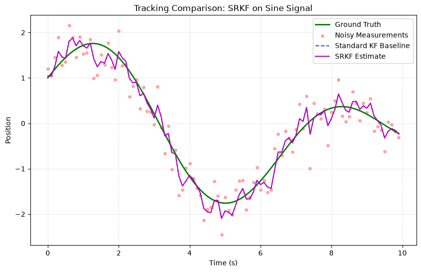
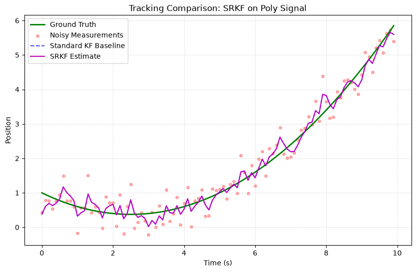
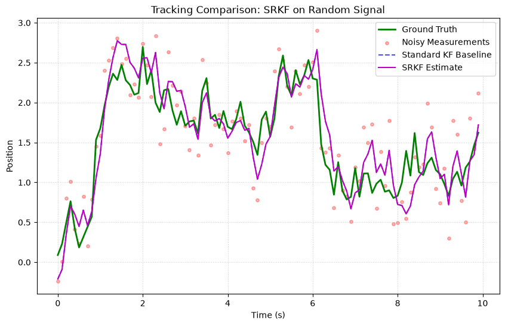

# Square-Root Kalman Filter (SRKF)

The Square-Root Kalman Filter (SRKF) is a numerically stable variant of the standard linear Kalman Filter. Instead of propagating the state covariance matrix $P$ directly, it maintains the Cholesky factor $S_P$ where $P = S_P S_P^T$. This formulation prevents the covariance matrix from losing positive-definiteness or symmetry due to floating-point rounding errors.

---

## Theory and Formulation

In many tracking scenarios, poorly-conditioned covariance matrices or round-off errors can cause the diagonal elements of $P$ to become negative, leading to filter crashes. The SRKF mitigates this by maintaining $S_P$.

### 1. Predict Step

Given the state transition matrix $F$ and the process noise Cholesky factor $S_Q$ (where $Q = S_Q S_Q^T$):
The predicted covariance Cholesky factor $S_{P^-}$ is reconstructed using the QR decomposition of a composite matrix:

$$
M^T = \begin{bmatrix} (F S_P)^T \\ S_Q^T \end{bmatrix}
$$

A QR decomposition of $M^T$ yields:

$$
M^T = Q_{qr} R_{qr}
$$

The upper triangular matrix $R_{qr}$ satisfies:

$$
R_{qr}^T R_{qr} = M M^T = F S_P S_P^T F^T + S_Q S_Q^T = P^-
$$

Therefore, the predicted Cholesky factor is:

$$
S_{P^-} = R_{qr}^T
$$

### 2. Update Step

Given the measurement matrix $H$ and the measurement noise Cholesky factor $S_R$ (where $R = S_R S_R^T$):
We form the composite update matrix:

$$
A^T = \begin{bmatrix} S_R^T & 0 \\ (H S_{P^-})^T & S_{P^-}^T \end{bmatrix}
$$

Computing the QR decomposition of $A^T$ gives:

$$
A^T = Q_{qr} \begin{bmatrix} X & Y \\ 0 & Z \end{bmatrix}
$$

Where:
- $X^T$ is the Cholesky factor of the innovation covariance $S$.
- $K = (Y^T (X^T)^{-1})^T = Y^T X^{-1}$ is the Kalman gain.
- $S_P = Z^T$ is the updated Cholesky factor of the covariance matrix.

---

## Usage Example

```python
import numpy as np
from kalbee import SquareRootKalmanFilter

# Define matrices
state = np.zeros((2, 1))
covariance = np.eye(2) * 10.0
F = np.array([[1.0, 1.0], [0.0, 1.0]])
Q = np.eye(2) * 0.01
H = np.array([[1.0, 0.0]])
R = np.array([[0.1]])

# Initialize and run
srkf = SquareRootKalmanFilter(state, covariance, F, Q, H, R)
srkf.predict()
srkf.update(np.array([[1.5]]))

print("Estimated State:\n", srkf.state)
print("State Covariance:\n", srkf.covariance)
```

---

## Simulation Results

Here is the tracking performance of the Square-Root Kalman Filter (SRKF) compared against the Standard Kalman Filter baseline on three different signal trajectories:

### 1. Sine/Cosine Signal


* **Analysis**: The SRKF maintains the Cholesky factor $S_P$ instead of the covariance matrix $P$. In this double-precision simulation, its estimates align exactly with the standard KF baseline.

### 2. Polynomial (Degree 2) Signal


* **Analysis**: During polynomial tracking, the SRKF mirrors the baseline's steady-state CV model lag, verifying correct mathematical equivalence.

### 3. Random Walk Signal


* **Analysis**: Reconstructs the exact same smoothing path as standard KF while protecting against numerical eigenvalues drift under recursive updates.
