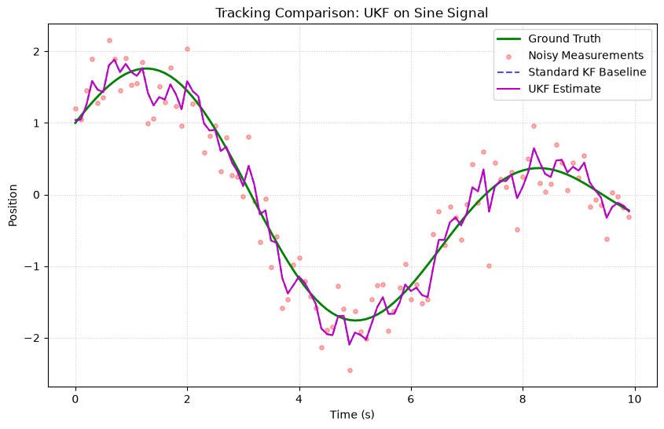
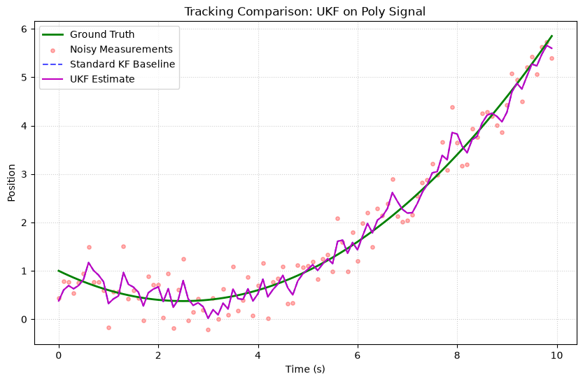
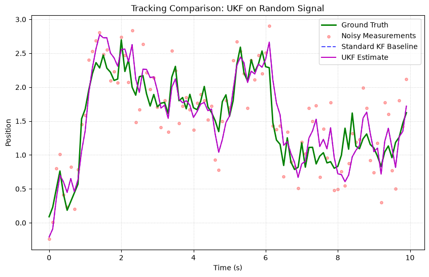

# Unscented Kalman Filter (UKF)

The **Unscented Kalman Filter** handles non-linear systems **without Jacobians**. Instead of linearizing, it uses a deterministic sampling technique called the **Unscented Transform** to capture the true mean and covariance to higher accuracy.

## Fundamental Concepts

### The Problem with Linearization

The EKF linearizes non-linear functions, which introduces error. For highly non-linear systems, this approximation can diverge. The UKF takes a fundamentally different approach:

> *"It is easier to approximate a probability distribution than to approximate a non-linear function."*

### The Unscented Transform

Instead of linearizing $f(x)$, the UKF:

1. **Generates sigma points** — a small set of carefully chosen sample points around the mean
2. **Propagates** each point through the true non-linear function 
3. **Reconstructs** the mean and covariance from the transformed points

For a state of dimension $n$, we generate $2n + 1$ sigma points:

$$
\begin{aligned}
\chi_0 &= \hat{x} \\
\chi_i &= \hat{x} + \sqrt{(n + \lambda) P_i} \quad i = 1, \ldots, n \\
\chi_{i+n} &= \hat{x} - \sqrt{(n + \lambda) P_i} \quad i = 1, \ldots, n
\end{aligned}
$$

Where $\lambda = \alpha^2(n + \kappa) - n$ controls the spread.

### Tuning Parameters

| Parameter | Default | Role |
|---|---|---|
| $\alpha$ | 0.001 | Spread of sigma points (small = tight around mean) |
| $\beta$ | 2.0 | Prior distribution knowledge (2 = optimal for Gaussian) |
| $\kappa$ | 0.0 | Secondary scaling parameter |

### When to Use

| ✅ Use UKF when | ❌ Don't use when |
|---|---|
| System is highly non-linear | System is linear (KF is simpler and faster) |
| Jacobians are hard to derive | Noise is non-Gaussian (use PF) |
| Need better accuracy than EKF | State dimension is very high (use EnKF) |
| Noise is Gaussian | — |

---

## How to Use

### Example: Non-linear Measurement ($z = x^2$)

```python
import numpy as np
from kalbee import UnscentedKalmanFilter

state = np.array([[2.0]])
covariance = np.eye(1) * 0.1
Q = np.eye(1) * 0.01
R = np.eye(1) * 0.01

# Just provide the functions — no Jacobians needed!
def transition(x, dt):
    return x  # Static state

def measurement(x):
    return x ** 2  # Non-linear measurement

ukf = UnscentedKalmanFilter(
    state, covariance, Q, R,
    transition_function=transition,
    measurement_function=measurement,
    alpha=0.001,
    beta=2.0,
    kappa=0.0,
)

# Track
np.random.seed(42)
true_state = 2.0

for _ in range(10):
    ukf.predict(dt=1.0)
    z = np.array([[true_state**2 + np.random.randn() * 0.1]])
    ukf.update(z)
    print(f"True: {true_state:.2f}  Estimated: {ukf.x[0,0]:.4f}  "
          f"Covariance: {ukf.P[0,0]:.6f}")
```

### 2D Tracking Example

```python
import numpy as np
from kalbee import UnscentedKalmanFilter

# State: [x_pos, y_pos, x_vel, y_vel]
state = np.zeros((4, 1))
cov = np.eye(4) * 10.0
Q = np.eye(4) * 0.1
R = np.eye(2) * 1.0  # Measure both positions

def transition(x, dt):
    F = np.array([[1, 0, dt, 0],
                  [0, 1, 0, dt],
                  [0, 0, 1, 0],
                  [0, 0, 0, 1]])
    return F @ x

def measurement(x):
    return x[:2]  # Observe [x_pos, y_pos]

ukf = UnscentedKalmanFilter(state, cov, Q, R, transition, measurement)
```

---

## Run an Experiment

```python
from kalbee import run_experiment

report = run_experiment(
    signal="sine",
    filters=["kf", "ekf", "ukf"],
    noise_std=0.5,
    duration=10.0,
    seed=42,
)
print(report.summary())

# UKF typically matches or outperforms EKF on non-linear signals
```

!!! note "UKF vs EKF"
    The UKF captures the statistics of non-linear transformations more accurately (up to 2nd order for Gaussian) compared to EKF (1st order only). The trade-off is slightly higher computation due to sigma point propagation.

---

## Simulation Results

Here is the tracking performance of the Unscented Kalman Filter (UKF) compared against the Standard Kalman Filter baseline on three different signal trajectories:

### 1. Sine/Cosine Signal


* **Analysis**: Under linear setups, the UKF's sigma points propagate the Gaussian state distribution exactly, matching the baseline Kalman Filter.

### 2. Polynomial (Degree 2) Signal


* **Analysis**: Like the standard KF, the UKF exhibits a steady-state lag during polynomial tracking since the constant velocity model is used.

### 3. Random Walk Signal


* **Analysis**: The UKF matches the baseline KF, confirming that the Unscented Transform behaves stably in the presence of random walks.
