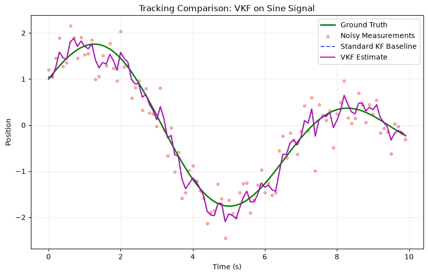
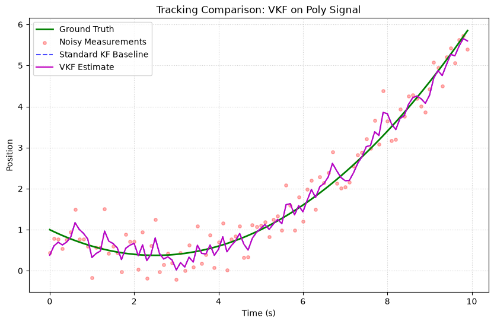
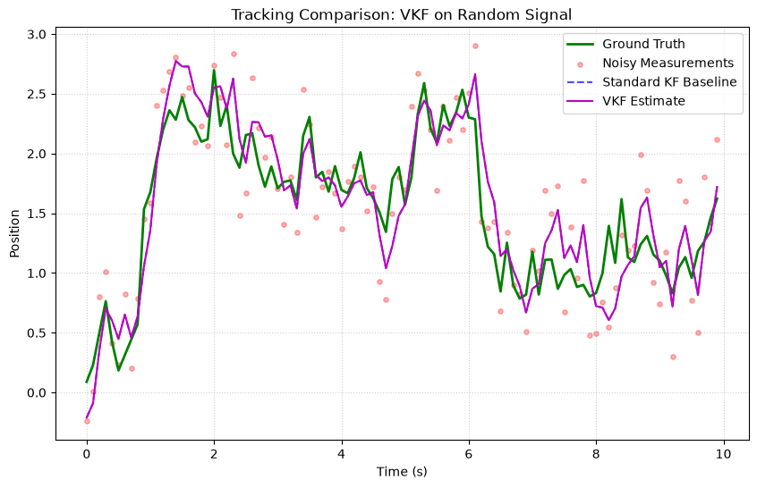

# Vectorized Kalman Filter (VKF)

The Vectorized Kalman Filter (VKF) is a high-performance implementation of the linear Kalman Filter optimized for tracking a large batch of independent targets simultaneously. 

By leveraging NumPy's batched matrix multiplications, it avoids Python loop overhead and scales efficiently to thousands of concurrent filters.

---

## Tensor Shapes

Unlike standard filters that expect 2D vectors and matrices, the Vectorized Kalman Filter operates on 3D tensors:

- **State ($x$)**: Shape `(batch_size, n, 1)`
- **Covariance ($P$)**: Shape `(batch_size, n, n)`
- **Transition Matrix ($F$)**: Shape `(n, n)` or `(batch_size, n, n)`
- **Process Noise ($Q$)**: Shape `(n, n)` or `(batch_size, n, n)`
- **Measurement Matrix ($H$)**: Shape `(m, n)` or `(batch_size, m, n)`
- **Measurement Noise ($R$)**: Shape `(m, m)` or `(batch_size, m, m)`

---

## Mathematical Implementation

The prediction and update steps use NumPy's `@` operator, which naturally broadcasts over the first (batch) dimension:

### Predict Step

$$
\begin{aligned}
x_{k|k-1} &= F @ x_{k-1|k-1} \\
P_{k|k-1} &= F @ P_{k-1|k-1} @ F^T + Q
\end{aligned}
$$

Where $F^T$ for a batched 3D tensor is computed via `np.swapaxes(F, -1, -2)`.

### Update Step

$$
\begin{aligned}
y &= z - H @ x_{k|k-1} \\
S &= H @ P_{k|k-1} @ H^T + R \\
K &= P_{k|k-1} @ H^T @ S^{-1} \\
x_{k|k} &= x_{k|k-1} + K @ y \\
P_{k|k} &= (I - K @ H) @ P_{k|k-1} @ (I - K @ H)^T + K @ R @ K^T
\end{aligned}
$$

---

## Usage Example

```python
import numpy as np
from kalbee import VectorizedKalmanFilter

batch_size = 1000  # Track 1000 targets at once
state = np.zeros((batch_size, 2, 1))
covariance = np.repeat(np.eye(2)[np.newaxis, :, :], batch_size, axis=0)

F = np.array([[1.0, 1.0], [0.0, 1.0]])
Q = np.eye(2) * 0.01
H = np.array([[1.0, 0.0]])
R = np.array([[0.1]])

# Initialize filter with expanded matrices
F_batch = np.repeat(F[np.newaxis, :, :], batch_size, axis=0)
Q_batch = np.repeat(Q[np.newaxis, :, :], batch_size, axis=0)
H_batch = np.repeat(H[np.newaxis, :, :], batch_size, axis=0)
R_batch = np.repeat(R[np.newaxis, :, :], batch_size, axis=0)

vkf = VectorizedKalmanFilter(state, covariance, F_batch, Q_batch, H_batch, R_batch)

# Predict & Update in a single operation
vkf.predict()
measurements = np.random.randn(batch_size, 1, 1)
vkf.update(measurements)

print("Batch States Shape:", vkf.state.shape)       # (1000, 2, 1)
print("Batch Covariances Shape:", vkf.covariance.shape) # (1000, 2, 2)
```

---

## Simulation Results

Here is the tracking performance of the Vectorized Kalman Filter (VKF) compared against the Standard Kalman Filter baseline on three different signal trajectories:

### 1. Sine/Cosine Signal


* **Analysis**: The VKF processes states in batched tensor forms. For a batch size of 1, it reproduces the Standard KF baseline estimates exactly.

### 2. Polynomial (Degree 2) Signal


* **Analysis**: VKF tracks the quadratic curve with the same constant-velocity steady-state lag, verifying the correctness of the batched matrix math formulas.

### 3. Random Walk Signal


* **Analysis**: Matches the standard KF baseline precisely, demonstrating that VKF scales the same estimation capabilities across parallel target arrays.
